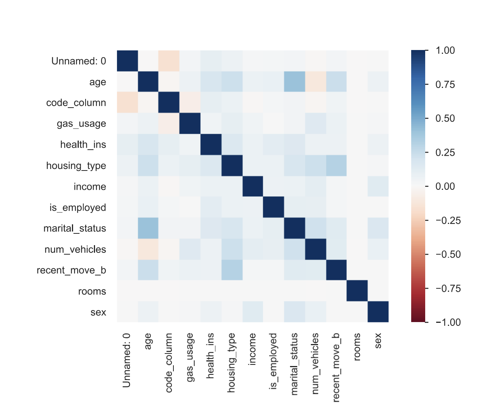
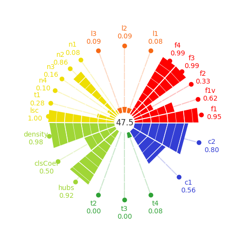
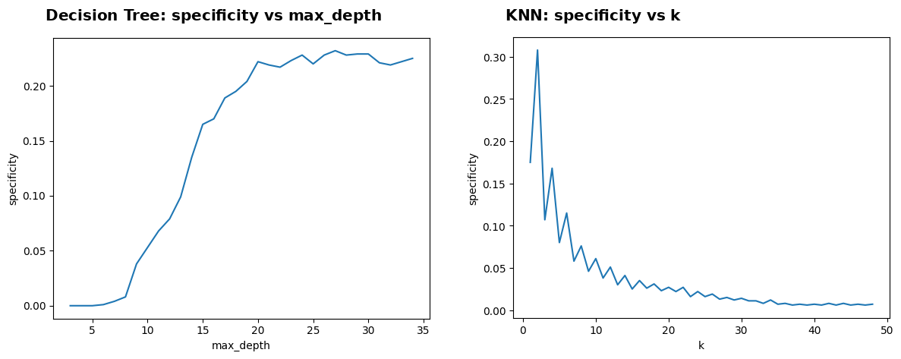
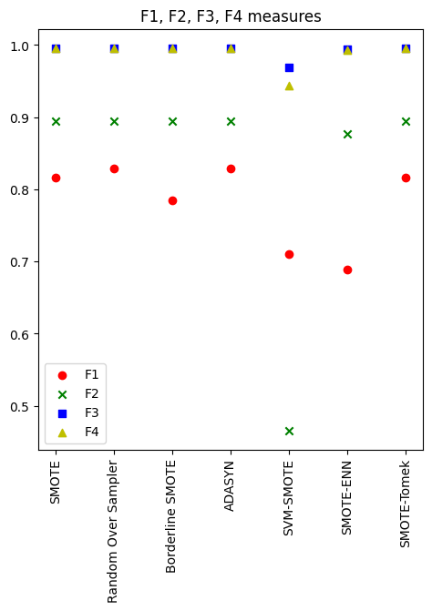
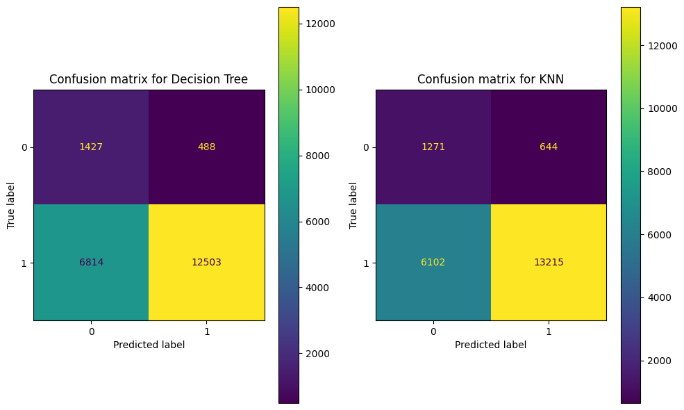

# Artificial Intelligence and Society: Data-Centric AI on a Health Insurance Dataset

> **Individual Assignments**
> <br />
> Course Unit: [Inteligência Artificial e Sociedade](https://sigarra.up.pt/feup/pt/ucurr_geral.ficha_uc_view?pv_ocorrencia_id=542585) (Artificial Intelligence and Society), 4th year
> <br />
> Course: **Msc. in Artificial Intelligence**
> <br />
> Faculty: **FCUP / FEUP**
> <br />
> Project evaluation: **17**/20

---

## Project Overview

This repository gathers three individual assignments that follow a single **data-centric AI** case study from start to finish. All three work on the same real-world **Health Insurance dataset** (72,458 customers, 15 socio-economic and demographic features), where the binary target `health_ins` indicates whether a customer has health insurance.

Rather than chasing model accuracy, each assignment looks at the *data itself*, and each one builds on the conclusions of the previous:

- **Assignment 1 – Data-Centric AI & Data Profiling:** Auditing data quality: missing values, outliers, redundant identifiers and target imbalance.
- **Assignment 2 – Data Complexity & Meta-Learning:** Quantifying *how hard* the classification problem is with 22 complexity measures (problexity) and relating them to different learning paradigms.
- **Assignment 3 – Imbalanced Learning:** Showing why accuracy and F1 were misleading, then rebalancing the data with seven oversampling strategies selected through complexity measures.

## Technical Approach

### 1. Data-Centric AI & Data Profiling
Using **YData Profiling** combined with manual exploration in Pandas and Seaborn, the dataset was profiled feature by feature and the main quality issues were documented, each with its consequence and a proposed fix:

- **Unique Identifiers:** `Unnamed: 0` and `custid` are per-record IDs with no predictive value, and a source of noise and overfitting.
- **Missing Data:** `is_employed` is **32% missing**. A further 1,687 rows (2.3%) share missing values across `housing_type`, `num_vehicles`, `gas_usage` and `recent_move_b`.
- **Outliers:** Ages of **0** and up to **120**, and **negative incomes** (range −6,900 to 1.26M).
- **Target Imbalance:** **90.5%** of customers are insured, which already signals a biased-classifier risk.
- **Relationships:** Weak correlations overall, with notable links between `marital_status` ↔ `age` and `housing_type` ↔ `recent_move`.



### 2. Data Complexity & Meta-Learning
After removing identifiers and incomplete rows (70,771 instances, 12 features), the full **problexity** suite was computed across its six families: feature-based, linearity, dimensionality, class imbalance, neighbourhood and network measures.

- **Scalability Workaround:** Neighbourhood and network measures rely on pairwise distances and graph construction, which proved infeasible at 70k rows. A **10% stratified sample** was used instead, and the measures shared with the full dataset were checked to confirm the sample preserved them (e.g. F1 0.947 vs 0.954, L2 0.091 vs 0.091, C2 0.802 vs 0.802).
- **Dimensionality:** PCA shows that a **single component** explains 95% of the variance (T4 = 0.083).
- **Open-Source Contribution:** While studying the T2 measure, an inconsistency between its name ("features per dimension") and its formula (features ÷ instances) was spotted and reported upstream in [problexity issue #9](https://github.com/w4k2/problexity/issues/9).

| Family | Key Measures |
| :--- | :--- |
| Feature-based | F1 = 0.947, F2 = 0.289, F3 = 0.994, F4 = 0.994 |
| Linearity | L1 = 0.083, L2 = 0.091, L3 = 0.091 |
| Neighbourhood | N1 = 0.079, N2 = 0.860, N3 = 0.158, LSC = 0.997 |
| Network | Density = 0.979, ClsCoef = 0.502, Hubs = 0.924 |
| Class imbalance | C1 = 0.561, C2 = 0.802 |



Three classical paradigms were then benchmarked with hyperparameter sweeps on an 80/20 stratified split:

| Model | Accuracy | F1-Score | Fit/Predict Time (s) |
| :--- | :--- | :--- | :--- |
| **Decision Tree** (max_depth = 5) | **0.909** | **0.952** | 0.14 |
| Logistic Regression (C = 1) | 0.909 | 0.952 | **0.03** |
| KNN (k = 19) | 0.908 | 0.952 | 6.48 |

All paradigms converged to nearly identical scores. As Assignment 3 goes on to show, this is exactly the **majority-class rate (90.9%)**.

### 3. Imbalanced Learning
**Preprocessing:** Missing `is_employed` values were treated as *not in the workforce*; the redundant `code_column` was dropped (a 1:1 encoding of `state_of_res`); `age` was clipped to [21, 99] and min-max scaled; right-skewed `income` and `gas_usage` were log-transformed; `housing_type` was merged into *owner* vs *non-owner*; categorical features were label/one-hot encoded.

**Exposing the problem:** With an imbalance ratio of **~10:1**, the "best" models from Assignment 2 hit 91% accuracy and 95% F1 while detecting almost none of the uninsured customers:

| Model (imbalanced training data) | Accuracy | F1-Score | Specificity |
| :--- | :--- | :--- | :--- |
| Decision Tree (max_depth = 5) | 0.910 | 0.953 | **0.0%** |
| Decision Tree (unlimited depth) | 0.846 | 0.915 | 22.0% |
| KNN (k = 20) | 0.910 | 0.953 | 2.7% |
| KNN (k = 2) | 0.815 | 0.895 | **30.8%** |

Deeper trees and fewer neighbours, the configurations that look *worse* on paper, were the only ones that captured the minority class.



**Rebalancing:** Seven resampling strategies from **imbalanced-learn** were applied to the training set only (to avoid leakage): **SMOTE**, **Random Oversampling**, **Borderline-SMOTE**, **ADASYN**, **SVM-SMOTE**, **SMOTE-ENN** and **SMOTE-Tomek Links**. Instead of picking one by trial and error, each resampled dataset was scored with the feature-based complexity measures from Assignment 2. **SVM-SMOTE** stood out with by far the lowest feature overlap (F2 = 0.466 vs ~0.89 for the other methods) and the lowest F3/F4.



**Re-evaluation:** After rebalancing, both models became genuinely able to identify uninsured customers:

| Model (rebalanced training data) | Accuracy | Precision | Recall | F1-Score | Specificity | G-Mean |
| :--- | :--- | :--- | :--- | :--- | :--- | :--- |
| **Decision Tree** (max_depth = 5) | 0.656 | **0.962** | 0.647 | 0.774 | **0.745** | **0.694** |
| KNN (k = 21) | **0.682** | 0.954 | **0.684** | **0.797** | 0.664 | 0.674 |



## Main Findings
- **Accuracy Can Lie:** On a 10:1 imbalanced problem, a model that predicts "insured" for everyone scores 91% accuracy and 95% F1. **Specificity**, **G-Mean** and **confusion matrices** were the metrics that revealed the real behaviour.
- **Specificity from 0% to ~75%:** Rebalancing raised minority-class detection dramatically, trading off headline accuracy that had never reflected real performance.
- **Complexity Measures as a Selection Tool:** Data complexity measures proved useful beyond diagnosis, as an objective criterion for choosing between resampling strategies before training any model.
- **Data First:** Most of the progress across the three assignments came from understanding and fixing the data, not from changing the algorithm.

## Retrospective Notes
- **Reading problexity scores:** problexity normalises every measure so that values near **0 mean a simple problem and values near 1 a complex one**. The high F1/F3/F4, LSC, density and hubs values in Assignment 2 therefore point to a *hard* problem with weak individual features, rather than strong separability. Similarly, L2 = 0.091 matches the minority-class share, meaning the internal linear classifier simply predicted the majority class. The SVM-SMOTE choice in Assignment 3 still holds under this reading, since it has the lowest F2, F3 and F4.
- **Final training set:** The notebook's re-evaluation cell assigns `X_smote, y_smote` (standard SMOTE) as the training data, even though SVM-SMOTE is the method selected in the text.

## Project Structure

```text
└── M.IA_Artificial-Intelligence-Society/
    ├── index.html          # Landing page linking every notebook and report
    ├── notebook1.html      # Assignment 1: Data Profiling (rendered notebook)
    ├── notebook2.html      # Assignment 2: Data Complexity & Meta-Learning
    ├── notebook3.html      # Assignment 3: Imbalanced Learning
    ├── report1.pdf         # Two-page report for each assignment
    ├── report2.pdf
    ├── report3.pdf
    ├── imgs1/              # Profiling figures (features/, correlations/, alerts, missing values)
    ├── imgs2/              # Complexity plot and problexity issue screenshot
    └── imgs3/              # Imbalanced-learning figures (specificity, resampling, confusion matrices)
```

## How to View

The notebooks are provided as rendered HTML exports, and the easiest way to browse them is through `index.html`:

```bash
git clone https://github.com/franciscopana/M.IA_Artificial-Intelligence-Society.git
cd M.IA_Artificial-Intelligence-Society
python -m http.server 5501
# open http://localhost:5501
```

To reproduce the analysis, the same Health Insurance dataset (`data.csv`) is available in the [Introduction to Data Science](https://github.com/franciscopana/M.IA_Intro-Data-Science) project repository, which extends this case study into a full prediction pipeline. Required packages:

```bash
pip install pandas numpy matplotlib seaborn ydata-profiling problexity scikit-learn imbalanced-learn
```

## Tech Stack

Python, Pandas, NumPy, Scikit-learn, Imbalanced-learn, Problexity, YData Profiling, Matplotlib, Seaborn, Jupyter

## Author

- **Francisco da Ana** (up202108762)
